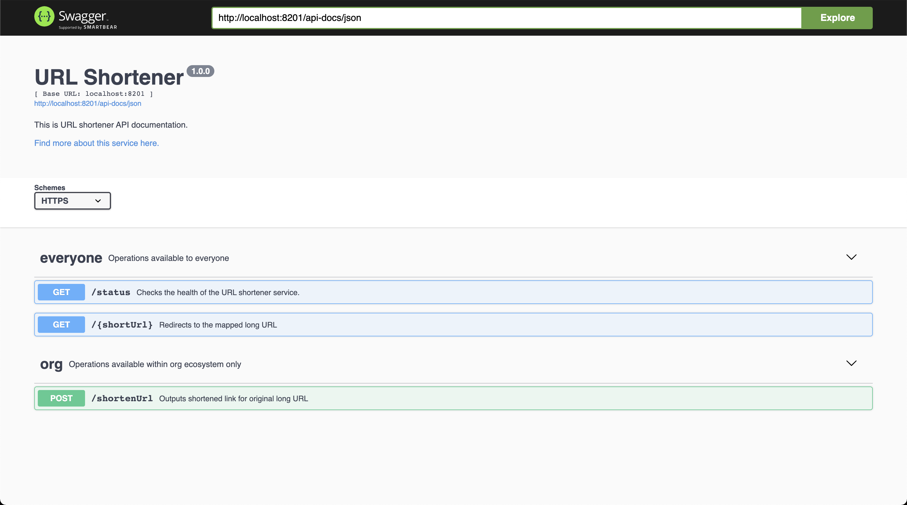

<div>

</div>

# URL Shortener


[](https://github.com/tterb/atomic-design-ui/blob/master/LICENSEs)

A simple URL shortener utility built with Nodejs, PostgreSQL, Redis and Kafka.


## Installation 

### Without Docker

- Clone the project

```
git clone git@github.com:smallcase/smalllinks.git
cd smalllinks
```

- Install the dependencies

```
npm install
```

- Source the environment variables present in `.example.env`. When running on local, make sure that PostgreSQL, Kafka and Redis are available & running.

```
source .example.env
```

- Then, you can run the server

```
npm start
```

or, you can run the server on dev with live reload

```
npm run dev
```

Open http://localhost:8201/status with your favorite browser to check the status of the service.

### Using Docker

`.example.env` file is used for environment variables. No changes are required in the env file to run with docker.

Then, run this in the project root level:

```
docker-compose up
```

The app will be running at http://localhost:8201, you'll be test out the service by visiting the swagger API docs at http://localhost:8201/api-docs
 
## Running Tests

To run tests, run the following command

```bash
  npm run test
```

## Usage/Examples

### To get the short URL

```bash
$ curl -d '{"url": "<LONG-URL>"}' -H 'Content-Type: application/json' <BASE_URL>/shortenUrl
```

or, you can explicitly provide the TTL (time-to-live) for the short URL. By default, TTL is set to 2 years ahead.

```bash
$ curl -d '{"url": "<LONG-URL>", "ttl": "2020-12-25"}' -H 'Content-Type: application/json' <BASE_URL>/shortenUrl
```

Response:

```json
{
    "shortUrl":"<SHORT-URL>",
    "longUrl":"<LONG-URL>"
}
```

### To get the long URL

```bash
$ curl -i -H 'Content-Type: application/json' <BASE_URL>/<SHORT-URL>
```

Response:

```
HTTP/1.1 302 OK
Date: Thu, 02 Jul 2020 10:31:09 GMT
Transfer-Encoding: chunked
Connection: keep-alive
Location: <LONG-URL>
```

Alternatively, you can use swagger API to test out the functionality:
  
## Using Swagger API

You can run the project locally by using the `Installation` steps mentioned above and head over to `/api-docs` to see the Swagger UI.



You can use it to generate new short URLs as well test the redirection.

However, two things to note while using Swagger UI to test out the functionality:

1. While redirection is capable of working through Swagger UI itself, there can be cases when redirection to the destination fails due to it being blocked by the CORS policy. The best way would be to simply paste the short URL in your browser and see redirection happen.
2. Make sure the _schemes_ is set to **HTTP** before using the API.

## FAQ

#### How a short key is generated?

It uses `nanoId` to generate a random string of predefined length.

#### How does it ensure the uniqueness of the key?

- `nanoId` doesn't ensure the uniqueness that's why there is an expiry date set at the time of short URL creation. A short key is open for reuse once the expiry date is hit.
- There are retries performed if it lands upon a non-expired short key during the random key generation process.
- Retries are capped and can be tweaked as per the requirement.

#### Does it support Analytics?

It uses Kafka to send events whenever a short URL is clicked. This gives the flexibility of plugging your own analytics service.

## Contributing

This project is open for any type of contribution. Feel free to open an issue if you have any query or found a bug.

## License

Licensed under the MIT License, Copyright © 2021

See [LICENSE](https://github.com/smallcase/smalllinks/blob/development/LICENSE) for more information.

## Used By

This project is used by the following companies:

- Smallcase Technologies Pvt Ltd
